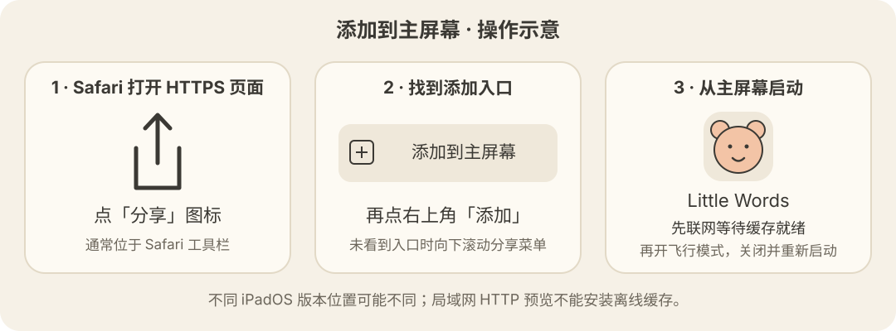

# Little Words · 小小单词

给 5–8 岁中文母语孩子的**离线**英语启蒙 Web App。跟着学校听课文、看动画，也可以在单词乐园玩小游戏，认识 8 个主题的 80 个基础单词。

把 HTTPS 网页「添加到主屏幕」，完成核心缓存和课程下载后，孩子在 iPad / iPhone 上可以**完全离线**独立使用。无账号、无服务器、无广告、无外部链接。

需求文档见 [SPEC.md](./SPEC.md)。

---

## 当前进度：v1.1.0 · M0–M5 + 一年级上册课本同步

已按用户要求连续完成剩余里程碑。家长功能、每日任务、时长限制及最终界面打磨均已实现；自动化验证记录如下。iPad / iPhone Safari 真机验收与 iPad 第 6 代 / A10 帧率仍待实测，下方未勾选项目保留真实状态。

**M0（骨架与离线）**

- Vite 5 + React 18 + TypeScript，hash 路由（`#/theme/animals`），刷新不 404
- 视觉规范 `src/styles/tokens.css`：暖米色纸感 Day 模式 + 暖深色 Night 模式，全部为低饱和护眼色
- 首页关卡地图（Animals 一个可用站点，其余 7 个 locked 占位）→ 主题页 → Learn 单词卡
- 陪伴角色 Momo（内联 SVG）：idle 呼吸 + 随机眨眼，进入首页打招呼
- **人声用预生成音频**（macOS `Evan (Enhanced)` 渲染，见下节）+ iOS 音频解锁
- PWA：manifest、图标自动生成、Service Worker 预缓存核心产物（含单词乐园音频）；v1.1 的课程材料另由家长下载
- iOS 专项：禁双击/捏合缩放、禁长按菜单、`safe-area` 内边距、`100dvh`
- 进度持久化到 IndexedDB，得星立即落盘

**M1（第一个游戏与反馈闭环）**

- Listen & Pick 完整流程：每局 8 题，开局 ▶ Start 解锁音频，4 个选项（1 正确 + 3 同主题干扰）
- 答对：放大 + 绿色描边 + 音效 + 小范围纸屑 + 星星 +1 + 角色 happy
- 答错：**轻微抖动 + 桃色描边 + 低柔音**（不用红色、不出红叉）+ 角色 encourage + 自动重读；第 2 次答错后正确项发光，点中即过且不计分
- 全部 7 个音效（tap / correct / wrong / celebrate / pop / flip / sticker），全用 Web Audio 合成
- 选词算法：权重 = `1 + wrong*2 + (unseen ? 3 : 0) + max(0, 3-correct)`，优先出答错过和没见过的词
- 局末结算 x/8 + 星星，最佳成绩写回主题页；局末立即落盘

**M2（地图、8 个主题、奖励）**

- **8 个主题共 80 个单词**：Animals / Fruits / Colors / Numbers / Vehicles / Weather / Body / Food，每主题 10 词
- 关卡地图：8 个站点沿一条平滑虚线路径排布，锁定 / 可用（呼吸）/ 已完成（挂徽章）三态；点锁住的关卡只给一声轻柔提示 + 小熊鼓励，不弹窗
- **解锁规则**：完成第 N 关解锁第 N+1 关。「完成」= 10 个词全部学过 **且** 任一游戏正确率 ≥ 80%
- emoji 表达不了的词改用内联 SVG：Colors 用色块、Numbers 用大数字 + 对应数量的圆点（不识字也能数）、`hair` 用手绘图标
- **贴纸**：每 10 颗星换 1 张，从 40 个 emoji 池里随机不重复地发；贴纸册按 8×5 网格展示，点一下会弹跳
- **徽章**：完成一个主题得一枚该主题的徽章（内联 SVG，缎带 + 主题色），同时出现在地图站点和徽章墙上
- 奖励庆祝层：贴纸放大旋转登场 + 纸屑 + 专属台词，4.2 秒自动关闭，点任意处也能关
- 进度自愈：读档时按星星数和主题完成情况补齐缺失的贴纸/徽章（支持导入存档与旧版本升级）

**M3（另两个游戏）**

- **Memory Flip**：手机 6 对（3×4），iPad 8 对（4×4）；一半图形、一半英文。翻牌朗读，配对 +1 星并保持翻开，不匹配停留 1 秒再翻回。整局完成另加 5 星，共 11 / 13 星。
- 开局按窗口短边选择规模；转屏只调整布局，不重洗牌或清进度。小窗口和分屏用 6 对，矮屏可滚动牌面。
- **Bubble Pop**：每局随机 10 个不重复目标，最多 5 个泡泡；10 秒缓慢上升后循环，飘走不扣星、不换题。点错轻晃和桃色描边，点对破裂 +1 星，整局另加 5 星，共 15 星。
- 两个游戏使用现有 8 个主题和打包的人声音频；Colors / Numbers / hair 复用 SVG 图形。
- 游戏在后台和贴纸/徽章遮罩期间暂停，回来接着玩；减少动态效果开启时，泡泡静止排列，仍可完成游戏。
- 连点和多指输入有同步结算锁；离开页面清理动画及人声。局末立即保存最佳成绩、星星和奖励。
- 人声下载/解码也遵守取消顺序：快速翻牌只播放最新单词，离开页面或切后台后，迟到的音频不会重新响起。
- **主题达标口径**：Learn 学完所有词后，Listen ≥7/8、Memory 完整配完一局（6 或 8 对）、Bubbles 首次点对 ≥8/10，任一即可获得徽章。泡泡点错后仍能继续并获得星星，最佳成绩只统计首次点对的目标。

**M4（家长功能与日常节奏）**

- 家长入口长按 3 秒，再完成随机两位数加法；可改用 4 位 PIN。直接打开家长地址也要验证，离开或切后台后失效。
- 家长页提供学习概览、80 词正确/错误/见过次数及排序；中文、音效、全部解锁、外观、语速 0.7–1.0、备用本地英文语音和每日限时设置。
- 每日固定 3 项任务：新词、听音选图、错词复习（无错词时为翻牌）。不足 5 词时缩小目标；全学过后改为复习。点任务可直接开始，复习需先听发音。
- 全部完成自动跳转庆祝页，+10 星只发一次，仍可继续玩。本地日期改变后重置任务、计时和当日加时；累计进度保留。
- 默认每日 20 分钟，可选 10 / 15 / 20 / 30 / 关闭。按真实前台时间差统计；家长空间、后台与休息页不计时。到点显示 Momo 晚安页，验证后当日再加 10 分钟。
- 外观自动跟随系统深色偏好或 19:00–7:00 时段；手动白天/夜间优先。新增晚安台词预生成录音。
- JSON 导出、严格校验后确认覆盖导入、两次确认重置。导入在同一 IndexedDB 事务中替换进度与设置，保留本机 PIN；备份不包含 PIN 和持久化权限。
- 关于页显示版本、网络与 Service Worker 状态、持久化存储授权、存储用量。

**M5（界面与运行打磨）**

- 手机横屏的学习卡可滚动，长单词换行；听音选图采用适合矮屏的布局，选项不再被裁切。
- 主按钮使用深色文字，白天次级文字加深，普通文字对比度达到 4.5:1；纸屑最多 68 粒、1.45 秒清理，减少动态效果时关闭纸屑和弹跳。
- 听音选图的延迟反馈也随后台与奖励层暂停；快速操作避免重复结算，获得贴纸立即保存。
- 构建前校验主题、单词字段及 ID 唯一；全部资源随构建打包，不使用外部运行时资源。

**M6（课本同步，2026-09-09）**

- 首页新增「课本同步 / 单词乐园」。6 个单元全部开放，家长选择学校当前单元，孩子一键进入，或接着上次的位置学习。
- 老师提供的 **61 份材料全部接入**：44 段音频、17 个动画，共 52.76 MiB。按单元、文件名页码与材料种类整理；6 个复习合集和 9 个附录单独展示。
- 音视频提供大号播放/暂停、重听、上一段/下一段和位置拖动；动画使用原片画面封面、原生全屏。默认原速，也可设为 0.85× / 0.7×。主动点播、结束停留、后台与离页暂停。
- 完整学习一段首次 +1 星：实际播放覆盖至少 90%，且等到片段结束才结算。拖到结尾不能冒领；重复播放不重复发首次奖励，也不会把单词自动记为掌握。
- 默认课程每日任务为「听课文、看动画、听单词」各一段；当天实际覆盖达到要求并播完才完成任务，全部完成 +10 星每天一次。已有当天任务保持原样，切换单元或来源从明天的任务生效。
- 家长页可下载当前单元或整册、暂停/重试、删除下载。逐文件校验大小和 SHA-256；缓存完整文件并支持离线 Range 跳转。删除下载保留星星与记录，备份包含新进度与设置，兼容旧存档。
- 课程计入每日限时，到点立即停止。中文开关、外观和已有奖励继续生效；课本媒体速度独立于单词乐园语速。
- 单元单词音频目前按原文件整段跟读。逐词点读、逐句跟读和课本专属题库仍需完整词表及句段校对；U2 / U6 提供现有数字 / 颜色拓展游戏入口，并明确其范围可能更广。

**跟读练习（M7 试用版）**

- 单词乐园的单词卡直接点击「跟读这个词」开始监听，不跳转、不播放示范音。首次需要浏览器麦克风授权；说完静音约 0.85 秒结束，最多监听 5 秒。
- 声音数据仅在内存中处理，不生成录音文件、不上传。切换单词、再次播放示范音、离开页面或切后台会释放麦克风；权限等待期间离开，随后到达的音轨也会立即关闭。
- 当前接入 Vosk Browser + 英文小模型（约 39MB），在浏览器 Worker 内离线识别当前目标词；首次使用需要下载并缓存模型。它只能判断“听起来像不像目标词”，不等于音素标准度，也不显示星星或清晰度分数。
- 课本本次保留原始音视频播放，先隐藏旧整段跟读入口；逐词跟读须等待词表和句段校对。

**本轮验证（2026-09-09）**

- `npm test`：14 个文件、132 项测试通过；内容校验、TypeScript、生产构建通过。
- 独立 Chrome 实际操作：音视频播放/暂停/续播、后台暂停、拖动、原地图入口、20 个课程页面/横竖屏尺寸组合；关闭中文后的窄屏界面与视频全屏进出通过。
- 生产版完整下载 61 份材料（55,327,436 字节）并逐份校验。断网冷启动、设置保持、M4A 音频播放/解码、视频播放/跳转、206 Range 响应通过。
- 实际播完三个课程每日任务，3 颗首次星星 + 10 颗每日奖励只结算一次；导出包含课程数据；删除全部下载保留进度。
- 下载取消、网络失败后重试、备份导入/重置、拖到结尾不奖励、到点中断与直达播放页拦截通过。
- 核心预缓存 214 项约 2.55 MiB；约 53 MiB 的课程媒体不进入自动预缓存。运行时无外网请求或脚本错误。
- iPad Safari 实际触控、全屏、主屏幕飞行模式与 A10 性能仍待真机验收。

**原 M0–M5 本地验证（2026-09-08）**

- `npm test`：12 个文件、116 项测试全部通过；TypeScript、内容校验与生产构建通过。
- 独立 Chrome 完整操作：家长加法/PIN/短按拦截、设置、导出、错误文件拒绝、取消/确认导入、重置二次确认；三个每日任务完整完成及 +10 星只发一次；后台不计时、到点拦截直达路由、家长加 10 分钟。
- 边界检查：错词定向复习、键盘长按家长门、后台撤销家长权限、跨午夜解除休息并重置当天数据、时段/系统外观切换。
- 布局检查：375×667、667×375、768×1024、1024×768，共 36 个页面/尺寸组合，无水平溢出、裁切内容或小于 64px 的可见按钮，无脚本错误。
- 生产版断网验证：194 项缓存资源（其中 184 段语音）；首页、每日任务、家长页、Learn、贴纸册及三种游戏冷启动通过；休息页和家长门可用；单词/例句/晚安录音可解码，无外网请求。
- 桌面 Chrome 生产版泡泡动画：4 倍 CPU 降速、1024×768、4 秒采样，平均 60fps，95% 帧耗时 ≤16.7ms。此结果仅作开发参考，不代表 A10 设备性能。
- iPad Safari 的实际听感、多指触控、主屏幕离线启动和 A10 ≥50fps，仍需下方真机验收。

---

## 发音方案：为什么不用运行时 TTS

一开始用的是 `speechSynthesis`（浏览器 TTS），发音是「词典腔」，不像母语者。原因有两层：

1. **iOS Safari 拿不到好语音。** Web Speech API **只暴露设备预装的 compact 档语音**；用户在「设置 → 辅助功能 → 朗读内容」里下载的 Enhanced / Premium 语音，网页里访问不到（[Apple 开发者论坛官方回复](https://developer.apple.com/forums/thread/723503)）。这个行为在 iOS 15–18 之间还反复变动过。
2. **各设备发音不一致。** 有的设备只剩 Eloquence 家族（1980 年代共振峰合成），比词典腔更机械。

听力是这个 App 的核心价值，发音质量不能交给设备决定。所以改成**构建期预生成音频**：

- 用 macOS `say` 的 **Enhanced / Premium 档语音**（默认 `Evan (Enhanced)`）渲染，`afconvert` 转 AAC-LC
- 三类片段：单词 `public/audio/w/*.m4a`、例句 `s/*.m4a`、角色台词 `p/*.m4a`
- 后处理：裁首尾静音 → 峰值归一化 → 8ms 淡入淡出（不裁静音点击反馈会发木；不归一化各词音量忽大忽小）
- 播放走 Web Audio（复用已解锁的 `AudioContext`），解码后缓存在内存，反复点同一个词零延迟
- **片段缺失自动回落到设备本地英文 TTS**；无可用本地语音时，家长页提示安装，正常打包片段不受影响
- 音效（tap 等）仍全部用 Web Audio 合成，不受影响
- 音频随构建产物被 SW 预缓存，**离线不受影响**

### 重新生成音频

改了词表、例句或角色台词后：

```bash
npm run audio            # 只生成新增/变更的片段
npm run audio -- --force # 全部重新生成
npm run audio -- --voice "Ava (Premium)"   # 换语音
```

首次需要先下载语音：**系统设置 → 辅助功能 → 朗读内容 → 系统语音 → 管理语音** → 英语（美国）里选带 **Enhanced** 或 **Premium** 标记的。当前用的是 `Evan (Enhanced)`——试听后觉得它最接近母语者。档位（Premium > Enhanced > compact）只保证技术质量下限，不代表听感排序，换语音前建议先用 `say -v "名字" "The cat is sleeping."` 听一下。没装任何 Enhanced/Premium 语音时脚本会报错并列出可用语音。

`npm run audio` **只能在 macOS 上跑**（依赖 `say`）。所以 `public/audio/*.m4a` 和 `src/content/audioManifest.json` 都提交进仓库，当作资源而非构建产物——CI 在 Linux 上跑，没法重新生成。v1.0.0 共 184 个片段，覆盖 80 个单词、80 个例句及角色台词。

`npm test` 会校验清单与词表一致、文件都存在、没有孤儿文件。改了例句忘了跑 `npm run audio`，测试会失败。

---

## 课程素材维护

原始文件夹保持不变。[素材清单](./docs/curriculum-inventory.json) 记录原路径、时长、单元和 SHA-256；`npm run course:import` 校验原件并生成 `src/content/curriculum.json` 与 `public/course-media/`。32 个扩展名为 `.mp3`、实际是 M4A 的文件在副本中纠正为 `.m4a`，不重新压缩；原片封面位于 `public/course-posters/`。U4 只展示实际存在的两个动画。

这三个生成位置都作为资源随项目保存。常规构建直接使用整理后的文件，Linux CI 无需原始中文目录或 macOS 音频工具；导入脚本在原件缺失时会验证已有副本。更新材料时先同步素材清单，再运行导入与测试。课程缓存按包含哈希的资源名区分版本；备份只有学习数据与设置，不包含音视频文件。

完整范围与后续文字校对见 [课本同步整合说明](./docs/课本同步整合方案.md)。

---

## 本地开发

需要 Node 18.19+（推荐 20+）。

```bash
npm install
npm run dev          # 已内置 --host，局域网可访问
```

常用命令：

| 命令 | 作用 |
|---|---|
| `npm run dev` | 开发服务器（热更新，**不启用 Service Worker**） |
| `npm run build` | 内容校验 → 生成图标 → 类型检查 → 构建到 `dist/` |
| `npm run preview` | 本地起服务跑 `dist/`（**这里才能测离线**） |
| `npm test` | 逻辑单测 + 原有音频与课程文件/哈希校验（Vitest） |
| `npm run course:import` | 根据素材清单校验并整理课程文件，生成运行时课程清单 |
| `npm run typecheck` | 只做类型检查 |
| `npm run icons` | 从角色 SVG 重新生成 PNG 图标 |
| `npm run audio` | 重新生成人声音频（**仅 macOS**，见上节） |

开发模式故意关掉了 Service Worker（`vite.config.ts` 里 `devOptions.enabled: false`），避免缓存干扰热更新。**离线功能必须在 `npm run preview` 或部署版本上验证。**

---

## 在 iPad 上测试

局域网 HTTP 适合检查游戏交互、发音和横竖屏。**iPad 飞行模式验收需要 HTTPS 构建版本**：Service Worker 需要安全上下文，`http://192.168…` 即使使用 `preview` 也不能安装离线缓存。Mac 自己的 `http://localhost` 可以测试缓存，这项例外不适用于 iPad 访问 Mac 的 IP。

### 1. 在 Mac 上起服务（局域网功能预览）

```bash
npm run build
npm run preview
```

### 局域网 HTTPS（麦克风与离线测试）

普通 `http://192.168...` 只适合看页面和在线播放。要在 iPad 上测试麦克风、Service Worker 和飞行模式，需要让 iPad 信任 Mac 的本地证书。局域网 HTTPS 仍要求 Mac 开机并保持服务运行。

Mac 已安装 Homebrew 时：

```bash
brew install mkcert
mkcert -install
mkdir -p .local-certs
mkcert -cert-file .local-certs/ipad.pem -key-file .local-certs/ipad-key.pem 192.168.0.27 localhost 127.0.0.1
HTTPS_CERT_FILE="$PWD/.local-certs/ipad.pem" HTTPS_KEY_FILE="$PWD/.local-certs/ipad-key.pem" npm run preview -- --port 4185 --strictPort
```

把 `mkcert -CAROOT` 输出目录里的 `rootCA.pem` 通过隔空投送发到 iPad，安装描述文件，然后在「设置 → 通用 → 关于本机 → 证书信任设置」里对该根证书打开完全信任。再用 Safari 打开 `https://192.168.0.27:4185/`。Mac 的局域网 IP 变化后，需要重新生成包含新 IP 的证书。

这套证书只适合家里或测试 Wi-Fi；正式给孩子使用，建议部署到 GitHub Pages 或 Vercel 的 HTTPS 地址，这样 Mac 可以关机。不要把 `.local-certs/` 或 `rootCA.pem` 提交到仓库。

终端会打印两行地址，记下 **Network** 那一行，例如：

```
➜  Local:   http://localhost:4173/
➜  Network: http://192.168.0.27:4173/     ← 用这个
```

如果没有打印 Network 地址，手动查 Mac 的局域网 IP：

```bash
ipconfig getifaddr en0        # Wi-Fi
ipconfig getifaddr en1        # 有线 / 雷雳网卡
```

### 2. iPad 打开并添加到主屏幕



1. 确认 iPad 和 Mac **连同一个 Wi-Fi**
2. 功能预览：iPad 用 **Safari** 打开 `http://192.168.0.27:4173/`。开发热更新可用 `npm run dev` 打印的 Network 地址（通常为 5173 端口）
3. 飞行模式验收：先按下方步骤部署到 GitHub Pages / Vercel，改为打开该 **HTTPS 地址**，或使用已在 iPad 上受信任的本地 HTTPS 服务
4. 在 HTTPS 页面点底部/顶部的**分享**按钮 <kbd>⇪</kbd> → **添加到主屏幕** → **添加**
5. 回到主屏幕，能看到小熊图标，名字是 **Little Words**

### 3. 等缓存装好（关键一步）

从主屏幕图标启动 App，**在线状态下**至少完整浏览一次：首页 → 主题页 → Learn 翻几张卡。
Service Worker 需要这一次联网启动来完成安装和预缓存。等 10 秒左右；长按首页齿轮进入家长页，在「关于与离线状态」确认 Service Worker 已就绪，核心单词乐园即可离线使用。也可用 Mac Safari 网页检查器查看预缓存。

**课本材料还需单独下载**：在家长页「学校课程 · 一年级上册」选择当前单元，点「下载整册 · 约 53 MiB」，等到显示 **已下载 61 / 61 份**。只需要近期内容也可下载当前单元。Service Worker 已就绪不代表课程下载完成；使用 HTTPS 正式构建版下载，开发热更新版不能离线冷启动。

### 4. 开飞行模式验收

1. iPad 上划出控制中心 → 打开**飞行模式**（或设置里关掉 Wi-Fi）
2. **完全关闭 App**：上划到多任务界面，把 Little Words 卡片划掉
3. 从主屏幕重新启动

逐项确认：

**课本同步（M6）**

- [ ] 家长选择学校当前单元，首页进入该单元；6 个单元和复习/附录均可访问
- [ ] 原声音频、动画能播放/暂停/重听，跳转位置准确；横竖屏与视频全屏正常
- [ ] 退出再进入可从上次位置继续，后台停止且返回不自动播放
- [ ] 下载整册后飞行模式冷启动，任意单元、合集和附录仍能听/看与拖动
- [ ] 正常播完可得首次星星；只拖到末尾不得星，重复播放不重复奖励
- [ ] 课程每日任务可完成且奖励一次；到时休息立即停止音视频
- [ ] 删除下载保留学习数据，导出导入包含课程位置和当前单元

**基础（M0）**

- [ ] 冷启动不报错、不白屏，首页正常显示
- [ ] 首次点击屏幕后，小熊说话有**声音**，发音自然（不是机械的词典腔）
- [ ] 首页切到「单词乐园」，点 Animals → 主题页 → Learn，能翻完 10 张卡
- [ ] 卡片上点 emoji 读单词，点单词文字读例句并显示例句
- [ ] 点 ⭐ I know it，右上角星星 +1，按钮变「已认识」，自动进下一张
- [ ] 双击屏幕、两指捏合**不会缩放**；长按文字**不出现**选字菜单
- [ ] 左上角返回按钮能一路回到首页
- [ ] 再次完全关闭 App 重开，星星数**还在**
- [ ] 横屏 ↔ 竖屏切换，布局正常，按钮不被遮挡
- [ ] 两只手同时乱点，不卡死、不报错

**Listen & Pick 游戏（M1）**

- [ ] 主题页点 👂 Listen & Pick → 开局页 → 点 ▶ Start 开始
- [ ] 每题自动读出目标单词，点大 🔊 能重听
- [ ] 答对：选项放大 + 绿色描边 + 悦耳音效 + 少量纸屑 + 星星 +1，小熊跳起说 "Great job!"
- [ ] 答错：选项**轻微抖动 + 桃色描边**，音效低柔不刺耳，**没有红色也没有红叉**；小熊点头说 "Try again!" 并自动重读单词
- [ ] 连错两次后，正确选项会柔和发光提示，点中即可进入下一题
- [ ] 走完 8 题有结算页（x/8 + 获得的星星），答对 ≥6 有庆祝音效和纸屑
- [ ] 结算页「再玩一次 / 回主题」都能用
- [ ] 回主题页，Listen 卡上显示「最好 x/8」
- [ ] 纸屑不遮挡屏幕中间的内容，1.5 秒内消失，不闪屏

**地图、8 个主题、奖励（M2）**

- [ ] 首页地图能上下滑动，看得到全部 8 个站点；**最后一个站点（Food）不被小熊挡住**
- [ ] 只有 Animals 可点（会轻微呼吸），其余 7 个是灰色虚线圈 + 🔒
- [ ] 点锁住的关卡：**不跳转、不弹窗**，只有一声轻柔提示音 + 小熊说鼓励的话
- [ ] 右上角 🗂️ 进贴纸册：40 个空位 + 8 个灰徽章位，文案显示「已收集 0 / 40 张」
- [ ] 在 Animals 里攒到 **10 颗星**：弹出庆祝层，贴纸放大旋转登场 + 纸屑 + 小熊说话
- [ ] 庆祝层背景是**不透明的米色**，看不到下层的按钮和星星透出来
- [ ] 庆祝层的英文和中文是**同一句话**的两种语言（不是各说各的）
- [ ] 庆祝层 4 秒左右自动关；中途点任意位置也能立刻关掉
- [ ] 回贴纸册，新贴纸已经在格子里；点一下贴纸有弹跳
- [ ] Animals 10 词学完 + 玩一局 Listen 拿到 ≥80%（8 题对 7 题）→ **得徽章 + Fruits 解锁**
- [ ] 徽章同时出现在地图 Animals 站点右上角和贴纸册的徽章墙上
- [ ] 逐个打开 8 个主题页，都显示 0/10 且能进 Learn 翻完 10 张卡
- [ ] **Colors**：卡片上是色块不是 emoji；`orange` 和 Fruits 里的橙子是两个不同的词
- [ ] **Numbers**：大数字旁边有对应数量的圆点，数字和圆点**上下居中对齐**（1 和 10 看着是一套设计）
- [ ] **Body** 最后一词 `hair`：显示的是手绘图标，不是方框或问号
- [ ] Colors 玩 Listen & Pick：4 个选项都是色块，**横屏时选项不会被压成细长条**，全部在屏幕内
- [ ] 飞行模式下，新加的 7 个主题的单词**都能读出来**（不是机械的词典腔）

**记忆翻牌与泡泡（M3）**

- [ ] 主题页 Memory / Bubbles 都能打开，Start 后有声音
- [ ] iPhone 12 张牌（6 对），iPad 16 张牌（8 对）；图和文字都能翻开并朗读
- [ ] 配错后有 1 秒看牌时间，此时第三张点不开；无负面音效。配对后始终翻开，只加 1 星
- [ ] 翻牌中途横竖屏切换，牌的位置关系、已匹配结果保留，所有牌可点
- [ ] 手机整局 +11 星，iPad 整局 +13 星；返回主题显示已完成和最多配对数
- [ ] 泡泡每题都有目标词和重听按钮，最多 5 个泡泡；飘出屏幕会回来，目标不变
- [ ] 点错只轻晃 + 桃色描边，泡泡不破；点中后 +1 星进入下一目标，连续乱点不重复加星
- [ ] 完成 10 个目标共 +15 星；故意在 2 个目标上先点错，再点对，主题页显示最好 8/10（此前无更高成绩）
- [ ] 弹贴纸期间游戏暂停，关闭后才继续；配错后立刻切后台，回来仍能看到那两张牌再翻回
- [ ] 泡泡切后台后不移动，回来接着漂浮且重新读目标；横竖屏切换不挤出边界
- [ ] iPad 开启「设置 → 辅助功能 → 动态效果 → 减弱动态效果」后，泡泡静止可点，没有纸屑和弹跳
- [ ] Learn 学完 10 词后，只完成一局手机 Memory，也能获得徽章并解锁下一主题
- [ ] 从 HTTPS 添加到主屏幕、缓存完成后，飞行模式冷启动，两种游戏都能玩且有声音；关掉再打开星星和最佳成绩还在

**家长功能与每日任务（M4）**

- [ ] 齿轮短按不打开；按住 3 秒出现随机加法，答错不进入，答对打开家长页。直接打开 `#/parent` 仍需验证
- [ ] 设置 4 位 PIN 后，离开再进入使用 PIN；切到后台再回来需要重新验证；可在已验证家长页改回加法
- [ ] 中文、音效、全部解锁、语速和外观改变后立即生效，重开仍保留；语音试听有声，学习记录可排序
- [ ] 三个今日任务均可点开；学新词、完成指定主题的一局听音选图、翻牌/错词复习后，三个圆点点亮
- [ ] 错词复习需先听发音并点击记住，重复点击同一词不增加任务数；任务词不足 5 个也能完成
- [ ] 全部完成自动打开庆祝页并加 10 星；退出、重开或重复玩不会再领当天 10 星
- [ ] 调到 10 分钟，切后台停留一会再回来，后台时间不计入；到点进入暖色晚安页并朗读
- [ ] 晚安页直接打开游戏或返回地址仍不能绕过；家长验证后增加当天 10 分钟，重新打开仍有效
- [ ] 本地日期变更后，任务、已用时长、额外时长重置，原来的星星和学习进度保留
- [ ] 自动外观在 19:00–7:00 或系统深色时切换；手动白天/夜间不随系统变化
- [ ] 导出 JSON 后可在「文件」中保存；导入前显示覆盖摘要，取消保留原进度；坏文件被拒绝
- [ ] 导入正确备份后星星、学习记录和设置恢复，本机 PIN 不变；重置只有第二次确认后才清空
- [ ] 飞行模式下家长门、每日任务、所有设置、导入导出与休息页均可使用

**最终打磨（M5）**

- [ ] iPhone 375×667 起、iPad 横竖屏与分屏均可操作；横屏学习卡可滚动看完整单词，返回/底部按钮不遮挡
- [ ] 夜间文字清晰，普通文字和按钮对比度足够；无闪屏，纸屑 1.5 秒内消失
- [ ] 开启「减弱动态效果」后，全部页面无弹跳/纸屑，泡泡静止可点，游戏和奖励照常结算
- [ ] iPad 第 6 代 / A10 实机用 Safari 时间线测泡泡、翻牌和庆祝：动画达到 50fps，后台无持续动画
- [ ] SPEC 第 16 节在 iPad / iPhone 的其余最终验收项目逐项通过

### 没有声音怎么办

iOS 要求音频必须由用户手势启动，所以**第一次点击屏幕之前不会有任何声音**，这是正常的。首页在音频解锁前会显示醒目的「▶ 点我开始」按钮，点它即可。

人声用的是打包进 App 的音频文件，**不依赖设备装了什么语音**。如果点了还是没声音：

- 确认 iPad 侧面的静音开关没打开、音量不是最小
- 确认没有连着蓝牙音箱/耳机
- 用 Mac Safari 远程调试（见下节）看 Console 有没有 `[clips] 解码失败`

### 用 Mac Safari 远程调试 iPad

页面出问题时看控制台最快：

1. iPad：**设置 → Safari → 高级 → 网页检查器** 打开
2. Mac：**Safari → 设置 → 高级 → 显示"开发"菜单**
3. 用数据线连上 iPad，Mac Safari 菜单栏 **开发 → [你的 iPad] → Little Words**

标准 Web Inspector 就打开了，Console / Network / Application（看 Service Worker 和 IndexedDB）都能用。
注意 standalone 模式启动的 App 在「开发」菜单里是单独一项，不在 Safari 标签页里。

---

## 部署

### GitHub Pages

仓库自带 `.github/workflows/deploy.yml`，推到 `main` 分支即自动部署。

首次需要在仓库 **Settings → Pages → Build and deployment → Source** 里选 **GitHub Actions**。

部署到 `https://<用户名>.github.io/<仓库名>/` 这种子路径时，`base` 必须设成仓库名。
workflow 已经自动用仓库名填好，本地手动构建时这样传：

```bash
BASE_PATH=/little-words/ npm run build
```

### Vercel

导入仓库即可，构建命令 `npm run build`，输出目录 `dist`。部署在根路径，不用改 `base`。

### 更新流程

改代码 → push → 各设备**下次联网启动**时自动更新到新版本。
Service Worker 用的是 `autoUpdate` + `skipWaiting`，不会弹「有新版本」的提示打扰孩子。

---

## 常见问题

**没有声音**
见上面「没有声音怎么办」。核心原因是 iOS 的音频手势限制，先点一下屏幕。

**改了代码，iPad 上还是旧版本**
Service Worker 会缓存住旧版本，需要联网冷启动一次才更新。想立刻强制更新：
删掉主屏幕图标 → Safari 里 **设置 → Safari → 高级 → 网站数据**，删掉对应条目 → 重新添加到主屏幕。

**进度丢失了**
进度存在 IndexedDB。以下操作会清掉它：Safari 清除网站数据、删除主屏幕图标后重装、iOS 在存储空间不足时自动清理。
App 启动时会调用 `navigator.storage.persist()` 申请持久化，能降低被自动清理的概率（家长页显示是否申请成功）。建议定期在家长页导出 JSON 备份。

**iPad 打不开 Mac 上的地址**
先确认两台设备同一个 Wi-Fi。再检查 Mac 的防火墙：**系统设置 → 网络 → 防火墙**，临时关掉或允许 node 接受连接。
公司/学校网络常做客户端隔离，这种情况下同一 Wi-Fi 也互访不通，可以用 Mac 开个人热点给 iPad 连。

**`npm run build` 报 `crypto is not defined`**
Node 18 下依赖链里 `@rollup/plugin-terser` 的 worker 线程缺少全局 `crypto`。
`scripts/build.mjs` 已经自动补上 `--experimental-global-webcrypto`，正常执行 `npm run build` 不会遇到。
如果直接跑 `npx vite build` 就会碰到——用 `npm run build`，或者升级到 Node 20+。

---

## 项目结构

```
src/
├── main.tsx              入口：音频解锁监听、TTS 初始化、SW 注册
├── App.tsx               路由分发 + Provider
├── router.tsx            hash 路由（自实现）
├── styles/               tokens.css（色彩变量）· global.css（重置、iOS 规则）
├── content/              词表 JSON、类型、角色台词、贴纸池、audioManifest.json · curriculum.json
│   └── svg/              emoji 表达不了的图形：色块 · 数字卡 · 头发 · WordArt 分发
├── audio/                clips.ts（预生成人声，主路径）· tts.ts（兜底）· sfx.ts · audioUnlock.ts
├── logic/                pickWords.ts · rewards.ts · memory.ts · bubbles.ts · daily.ts · backup.ts · appearance.ts · courseProgress.ts
├── course/               downloads.ts（独立媒体缓存、下载与删除）
├── store/                db.ts（IndexedDB）· progress.ts · settings.ts · AppContext.tsx
├── components/           Mascot/ · WordCard · BigButton · StarCounter · BackButton · Confetti
│                         · Badge · RewardOverlay · ParentGate · Modal · GameButton · GameScreen
├── pages/
│   ├── Home.tsx          课本入口与关卡地图
│   ├── Course.tsx · CoursePlayer.tsx  单元、材料列表与播放器
│   ├── Stickers.tsx      贴纸册 + 徽章墙
│   ├── ThemePage.tsx · Learn.tsx · NotFound.tsx
│   ├── DailyDone.tsx · GoodNight.tsx · Parent.tsx
│   └── games/            ListenPick · MemoryFlip · BubblePop
└── hooks/                useVoice · useSfx · useAudioUnlocked · useGameLoop · useGameProgress · useDailyTimer

scripts/
├── gen-icons.mjs         从角色 SVG 生成 PNG 图标
├── gen-audio.mjs         生成人声 m4a（仅 macOS）
├── import-course.mjs     校验老师材料、整理格式与课程清单
├── validate-content.mjs  构建前校验词表
├── build.mjs             构建包装（处理 Node 18 的 crypto 问题）
└── lib/                  wav.mjs（WAV 读写）· audio-post.mjs（裁静音/归一化/淡入淡出）

tests/                    content · router · audio · clipsPlayback · sfx · pickWords · rewards · memory · bubbles · daily · backup · appearance · course（129 个单测）

public/
├── icons/                构建产物，已 gitignore
├── audio/                w/*.m4a · s/*.m4a · p/*.m4a（提交进仓库）
├── course-media/         61 份原声课程文件（提交进仓库）
└── course-posters/       17 张原片画面封面（提交进仓库）
```

## 设计约束（改代码前请先读）

这些是 SPEC 里的硬性要求，不是风格偏好：

- **不引入任何运行时需要联网的资源**。不用 Google Fonts、不用 CDN、不用外部图片/音频 URL。界面图形使用 emoji 和内联 SVG，课本动画封面取自本地原片；单词乐园人声是预生成 m4a，课程使用老师提供的本地音视频，全部随产物打包。音效用 Web Audio 合成。
- **护眼**：大面积区域饱和度 ≤ 35%，禁止任何 > 3Hz 的闪烁，不用纯白纯黑。
- **零挫败**：没有"失败""游戏结束""倒计时"。答错不扣分、不出红叉、不用红色——用轻微抖动 + 桃色描边 + 低柔音。
- **触控目标 ≥ 64×64 px**，相邻间距 ≥ 12 px。
- **不加任何数据上报、分析、广告、第三方 SDK、外部链接。**
